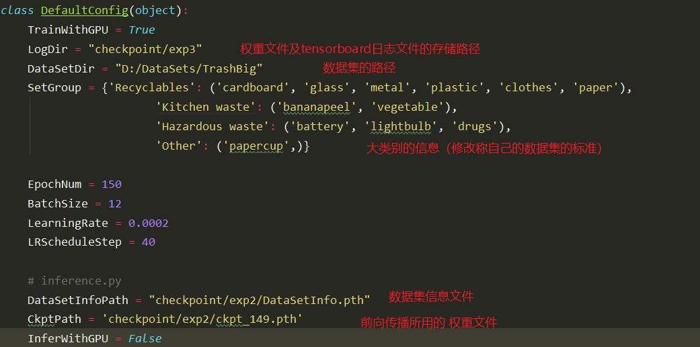

# Garbage-Classification

## 基于 OpenCV 的目标检测

`detect.py` 为视频目标检测参考代码，利用 Opencv，包括 knn，mog2，grabcut 三种方式，可根据实际效果选择。

## 基于 MobileNet V3 的垃圾分类

### 程序结构


+ `main.py`: 模型训练代码
+ `inference.py`：前向传播
+ `config.py`: 程序运行时的相关参数
+ `data/TrashSet.py`：垃圾数据集类
+ `images/文件夹`：提供一些测试图片
+ `models/mbv3_small.pth.tar`：mobilenet v3 在 imagenet 预训练权重
+ `models/mobilenetv3.py`: 模型文件
+ `utils/文件夹`：提供一些关于 imagenet 的可用函数

### 模型训练结果

#### 数据集

自己采集的垃圾分类数据集 TrashBig, 其中有 12 个小类别：

```
['bananapeel', 'battery', 'cardboard', 'clothes', 'drugs', 'glass', 'lightbulb', 'metal', 'paper', 'papercup', 'plastic', 'vegetable']
```

这12个小类别分别属于四个大类别：

```
{'Recyclables': 2624, 'Kitchen waste': 939, 'Hazardous waste': 1581, 'Other': 963}
```

训练集图片共计 6000 张左右。验证数据集每类 60 张左右，共计 720 张左右。

#### 训练结果


大类别的分类精度都在 90% 以上。

### 使用自己的数据集训练模型

1. 程序运行环境：Pytorch 1.0 以上版本、opencv-python、numpy、tensorboard。
2. 数据集的组织要求：数据集目录下分为两个小目录：train 和 val。每个小目录下以类别名称命名的文件夹，存储对应类别的图片。
3. `config.py` 文件的修改：对 `config.py` 文件进行修改：
   
4. 运行 `main.py`。

### 运行前向传播测试

直接运行 `inference.py` 即可测试。修改 `config.py` 中 `DefaultConfig.InferWithGPU` 参数即可切换前向传播使用 GPU 还是 CPU。对 `inference.py` 文件稍加修改即可对自己的图片进行分类。